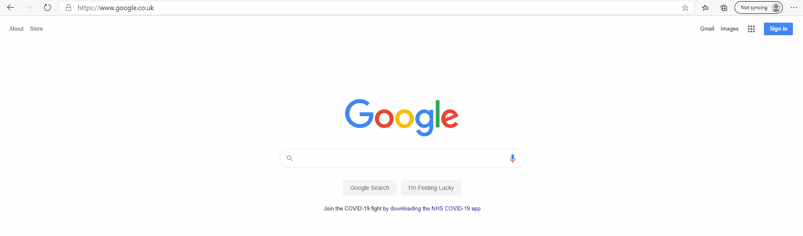

# Python joker

## Introduction

In this tutorial you will make a python program that will print out jokes.

### Requirements

It's probably best that you've done a bit of python before. If you have already done a lot then we have extensions later on you can try.

### Setting up your editor

Head on over to [https://repl.it](https://repl.it) and then hit start coding then search for python.


 
If you ever get stuck ask for help and send a mentor the link to your code. Anyone who has access to your link will be able to see your code and help you out (but not edit it).

[OPTIONAL] If you create an account you can allow mentors to help edit your code and not just see it. (press the share link in the top right then copy the generated link).


## 1. Getting started

Let's learn how to get the users input and then to output variables:
```python
name = input('What is your name? ')
print('Hello ' + name)
```

## 2. Understanding lists

When we store lists of items in computers we store them in what are called arrays.

Here is an example:

```python
my_array = ['item_a', 'item_b', 'item_c']
```

my_array is now a list containing three items.

**Terminology**: an item in an array is called an element.

Unlike us humans who start counting from one, computers start counting from zero.

```python
my_array = ['item_a', 'item_b', 'item_c']
                0         1         2
```

A position within an array is called an index.

If we wanted to access "item_b", which is the the second item in the array,  we would want the value at index 1.

```python
print(my_array[1])
```


## 3. Looping over lists

Now we have a list, so what can we do with it?

We can loop over the list which means that we go through each item in it one at a time.

The easy syntax for this is:

```python
for element in my_array:
  # Do something with the element
  print(element)
```

Each time we loop around, the variable called element becomes the next element in the array.

Let's look at this example:

```python
# We create a list called `greetings` with these three elements
greetings = ['Hi.', 'How are you?', 'Good morning.']

# We loop over every element in `greetings` and each time the variable `greeting` (no 's' at the end) becomes one of the greetings in the list.
for greeting in greetings:
    print('Loop!')
    print(greeting)
```


### Extensions

Try these extensions:

1. Change the program to not print Loop! each time and only print the greeting
2. Add another greeting such as Hi or Good afternoon


## 4. Putting it all together

### One last thing:

You will find that when putting text in quotes ('random text') it is difficult when there is lots of text than goes onto more than one line. Fortunately python has you covered with the use of tripple quotation marks. See this example:

```python
some_other_text = '''Long winded
text that is difficult to store in just single quotes.'''

mylist = ['''text that goes onto
more than
one line''', '''Some more text that is in another element
of the list''']
```

### Back to the coding:

1. Try to come up with some jokes for the program to say. If you can't think of anything to say look up some jokes online.
2. Create an array called `jokes` with a few of the best jokes you've found (make sure you have at least 2 jokes). Each element of the array should be one joke.
3. Loop through each element of the array and print out the jokes one by one.
